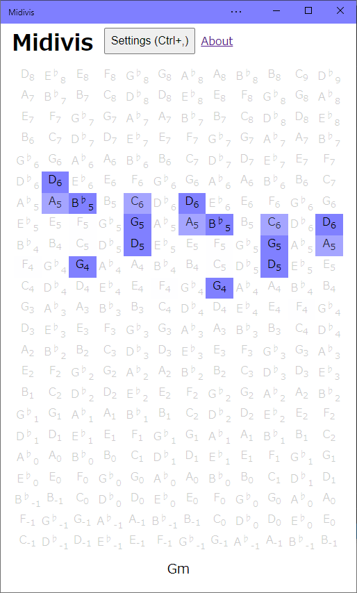

# Midivis - Visualize MIDI notes



Try it out: https://midivis.ryusei.dev/

Make sure to use browsers which support Web MIDI API, such as Google Chrome or Microsoft Edge.

Mozilla Firefox is currently not supported. See: https://bugzilla.mozilla.org/show_bug.cgi?id=836897

## Deployment

Build output is deployed to Cloudflare Pages project `midivis`.

```sh
npm run deploy:cloudflare
```

## Shortcuts

- Alt+S: Toggle "use sharp notes"
- Alt+1: Change color scheme to "Single color"
- Alt+2: Change color scheme to "Pitch interval / 12 semitones (octave)"
- Alt+3: Change color scheme to "Circle of fifths / Circle of fifths"
- Alt+4: Change color scheme to "Circle of fifths / Axis system"
- Alt+5: Change color scheme to "Pitch interval / 7 semitones (perfect fifth)"
- Alt+6: Change color scheme to "Pitch interval / 4 semitones (major third)"
- Ctrl+, / Cmd+,: Open Settings
- Escape: Dismiss an error or close Settings

## Settings

Note arrangements are grouped into interval grids, harmonic layouts, keyboard and
button layouts, and string instrument fretboards. Wicki–Hayden and Jankó expose
shape and range variants separately. Existing saved layouts are retained.

The Settings button stays available even when the toolbar is hidden. Settings
open in a non-modal side panel; its Close button remains visible while the
contents scroll. Closing returns keyboard focus to the opener.

Vertical tabs separate Connection, Visualization, UI, Chords and Transpose. Use Up/Down
arrows or Home/End on the tab list, then Tab to enter the selected category.
The last selected tab is retained when reopening settings during the session.

Changes apply and save immediately. Chord naming options reformat the displayed
chord without waiting for another note. Transposition is edited per channel in
semitones; invalid values leave the previous setting applied and show an inline
explanation. The device list updates when inputs are added or removed, reports
connection progress, and offers a manual refresh for permission/device recovery.

## UI languages

English and Japanese are supported. UI → Language offers Automatic,
English and 日本語. Automatic uses the first supported entry in the browser's
language preferences (including regional tags such as `ja-JP`), falling back to
English. Explicit choices are saved with the other settings. Existing settings
without a language preference default to Automatic.

Language changes update labels, accessible names, input options, connection
status and visible errors without reconnecting MIDI or rebuilding the keyboard.
The About page uses the same preference. Device names, note/chord notation,
proper names and legal license bodies are not translated.

To add a language, add a catalog in `src/locales` with the keys and placeholders
from `en.js`, register it in `src/i18n.js`, extend the preference validation in
`src/state.js`, and add its native language name to `state-language` in the HTML.
Static UI text uses `data-i18n` (or `data-i18n-title` / `data-i18n-aria-label`);
dynamic messages use typed translation keys and named placeholders. Application
errors carry stable keys, while original browser/device errors remain available
in the console for diagnostics. Catalog and browser tests cover translation
completeness, detection, persistence and switching while connected.

## Development and tests

Use Node.js 24 or later and Bun 1.3.12 (the committed `bun.lockb` is the
source of dependency versions). The application remains JavaScript with JSDoc;
TypeScript checks `src` without emitting code. Webpack configuration remains
CommonJS, while `src/package.json` declares application modules as ESM.

```sh
bun install --frozen-lockfile
npm test                 # Node unit and jsdom integration tests
npm run typecheck        # Check application JavaScript/JSDoc
npm run check            # Unit tests, typecheck and production build
bun x playwright install chromium
npm run test:browser     # Build, serve locally, and test in Chromium
```

Browser tests use fake Web MIDI ports, require no MIDI hardware or permission
prompts, and bind `127.0.0.1:4173`. Service workers are disabled in that test
context so cached deployments cannot mask changes. Screenshots of square,
hexagonal and slanted layouts are saved under `test-results/`; failed runs also
retain traces. GitHub Actions runs these checks on pushes and pull requests.
Actual device permissions and hardware behavior still need a manual smoke test.

## Code organization

- `src/midi-port-selector-webmidi.js`: Web MIDI access and serialized connection
  lifecycle. Inputs are selected by ID, with legacy saved names accepted.
- `src/midi-message.js`: decode bytes into typed events; timestamps use
  milliseconds on the `performance.now()` time origin, not elapsed deltas.
- `src/midi-device.js`: the shared performance state, independent of the DOM.
  Raw note numbers identify held notes; per-channel offsets are applied on read.
  A clock can be injected for deterministic tests. Consumers subscribe and
  explicitly unsubscribe when disposed.
- `src/chord.js` and `src/chord-printer.js`: chord recognition and presentation.
- `src/note-arrangement.js`: the single layout registry and pure `layoutCells()`
  calculation. Cells expose pitch, lattice coordinates, displayed row/column,
  padding and visibility. Repeated pitches are retained as distinct cells.
- `src/note-style.js` and `src/chord-visualizer.js`: pure note presentation rules
  and the DOM view of shared performance state.
- `src/state.js`: isolated settings stores, validation and persistence. Storage
  and error handling can be injected; snapshots do not share mutable arrays.
- `src/settings-ui.js`, `src/app.js`, `src/renderer.js`: settings controls,
  application composition and the browser entry point, respectively.

To add a layout, add its ID to `src/typedef.d.ts` and its definition to the layout
registry, then test representative coordinates and rendering. To add MIDI
expression, extend decoded event types and state transitions before adding view
behavior. History and layout comparison can consume performance events and pure
layout cells without reading DOM elements.

Regression tests intentionally retain the existing 200ms **note-on** window,
chord-name retention on release, binary highlighting and the current
CC120/121/123 release policy. Changing these musical/display policies belongs in
separate feature changes. The existing Jankó Slanted viewport-width approximation
is preserved, with its FIXME still present. Layout fixture hashes capture the
pre-refactor labels and styles of every cell; do not regenerate them simply to
make a failing refactor pass.
